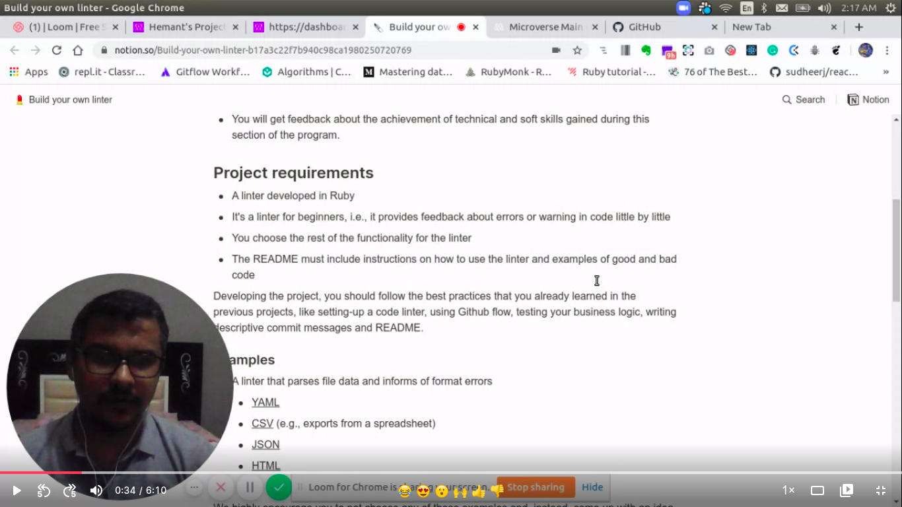
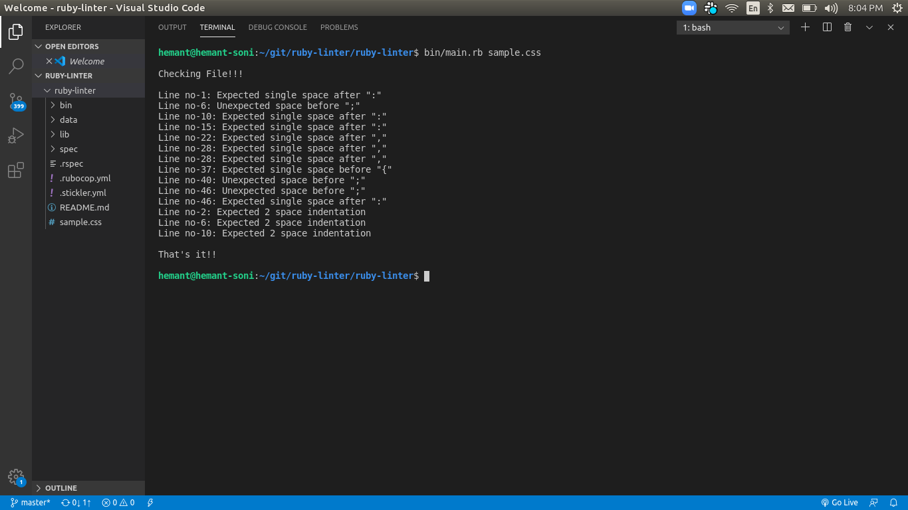
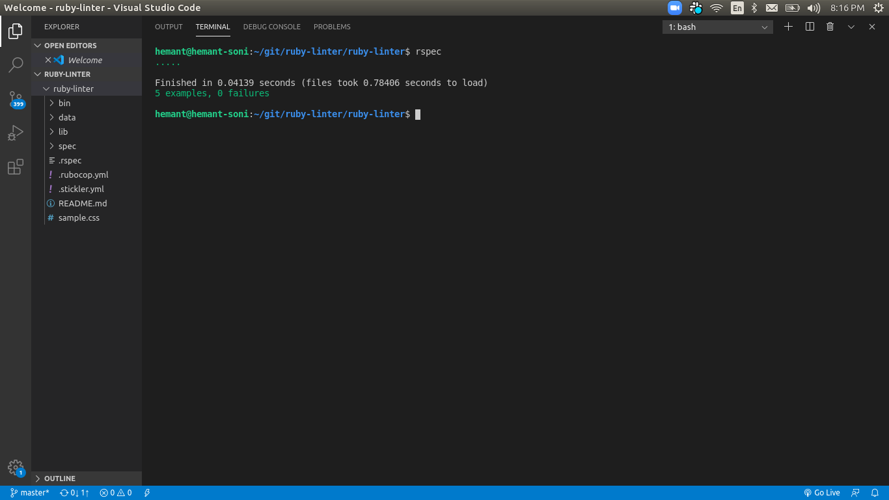

# Ruby-linter

> The project build a linter for CSS files that checks for line spacing errors in your code. The project is build using ruby with Rspec (TDD) testing for each method used in project.

## Video presentation

## Built With

- Ruby

### Prerequisites

- Install Ruby's latest version on your machine

### Install

- Install any code editor you like

# Getting Started

To get a local copy up and running follow these simple example steps.

- Open a terminal or command prompt interface on your machine
- Clone the project on your local machine: `git clone https://github.com/hemant-soni-vst-au4/ruby-linter`
- From your terminal enter the project directory using `cd ruby-linter`

# Instructions

- To check for errors in your css file run the code `ruby bin/main.rb + path to css file`

# How it works
The linter scans through the css file and returns an error with the line number of where that error occurered. **This linter checks for line spacing errors and indentation errors**.
The errors this linter checks for are errors like the following below:

* Bad Code
 `.body{color: blue}` this will result in an error because the linter is expecting a space after the selector `.body`, so it should look like this...
* Good Code
 `.body {color: blue}`

* Bad Code
 `.body {color:blue}` this will result in an error because the linter is expecting a space after the attribute `color:`, so it should look like this...
* Good Code
 `.body {color: blue}`

* Bad Code
 `.blue,p {height: 100px}` this will result in an error because the linter is expecting a space after the selector `.blue` before the next selector `p` so it should look like this...
* Good Code
 `.blue, p {height: 100px}`

## Screenshot of code output

## Screenshot of rspec output
- Testing for methods like `line_spacing_before`, `line_spacing_after`, `indentation_error` done using Rspec(TDD). 
- To check output of tests run command in terminal: `rspec`

## Authors

👤 **Hemant soni**

- Github: [@githubhandle](https://github.com/hemant-soni-vst-au4)
- Twitter: [@twitterhandle](https://twitter.com/abdelperez11)
- Linkedin: [linkedin](https://www.linkedin.com/in/hemant-soni-97427b193/)

## 🤝 Contributing

Contributions, issues and feature requests are welcome!

Feel free to check the [issues page](https://github.com/hemant-soni-vst-au4/ruby-linter/issues).

## Show your support

Give a ⭐️ if you like this project!

## Acknowledgments

- https://www.microverse.org/.

## 📝 License

This project is [MIT](lic.url) licensed.